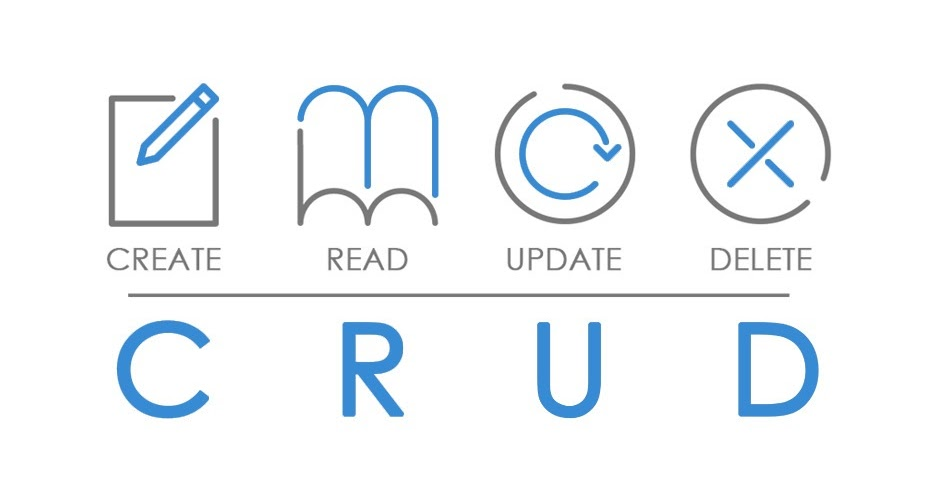
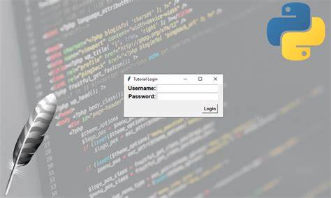

# Introduccion

En este repositorio se implementara una aplicacion con Tkinter aplicando CRUD a una base de datos relacional en SQLITE3.

## CRUD: la base de la gestión de datos
El concepto CRUD está estrechamente vinculado a la gestión de datos digitales. CRUD hace referencia a un acrónimo en el que se reúnen las primeras letras de las cuatro operaciones fundamentales de aplicaciones persistentes en sistemas de bases de datos:

* Create (Crear registros)
* Read bzw. Retrieve (Leer registros)
* Update (Actualizar registros)
* Delete bzw. Destroy (Borrar registros)

En pocas palabras, CRUD resume las funciones requeridas por un usuario para crear y gestionar datos.

## Tkinter

Tkinter es un módulo de interfaz gráfica de usuario (GUI) para Python, puede crear aplicaciones de escritorio con Python. Puede hacer ventanas, botones, mostrar texto e imágenes, entre otras cosas.

## SQLite

SQLite es una biblioteca de lenguaje C que implementa un motor de base de datos SQL pequeño, rápido, autónomo, de alta confiabilidad y con todas las funciones. SQLite es el motor de base de datos más utilizado en el mundo. SQLite está integrado en todos los teléfonos móviles y en la mayoría de las computadoras y viene incluido dentro de innumerables otras aplicaciones que las personas usan todos los días.

